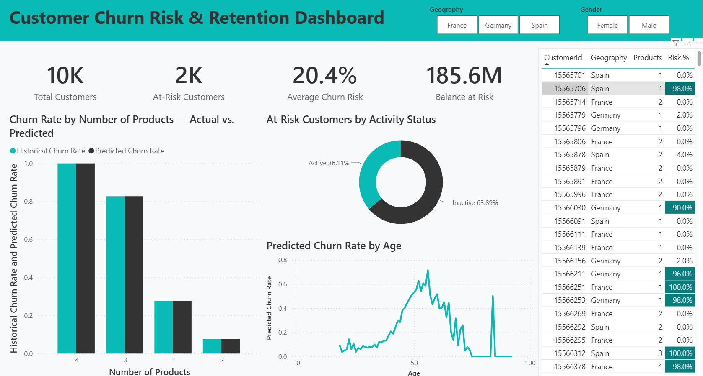
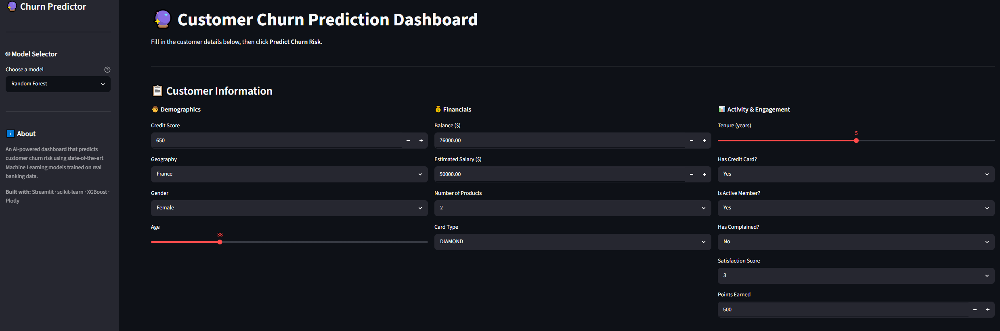
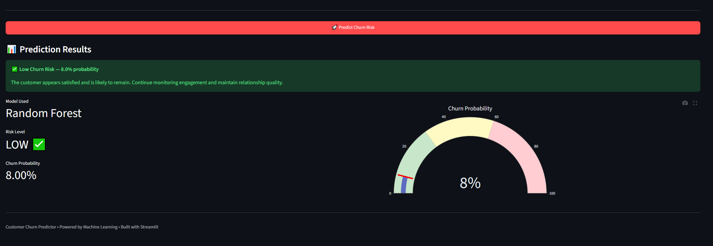

# 🏦 Bank Customer Churn Prediction & Retention Project

Welcome to the **Bank Customer Churn Prediction** project! This is an end-to-end data science and business intelligence solution designed to identify high-risk customers, uncover key churn drivers, and deliver actionable insights through predictive modeling and strategic dashboards.

---

## 🎯 Project Objectives
1. **Early Churn Detection:** Build and deploy machine learning models to accurately forecast the probability of a customer leaving the bank.
2. **Financial Risk Mitigation:** Quantify the financial impact of churn by calculating "Total Capital at Risk" to empower the management team.
3. **Enhance Customer Retention:** Highlight critical pain points (such as unresolved complaints and product count anomalies) to trigger timely retention campaigns.
4. **Professional Implementation:** Follow enterprise-grade workflows including SQL database normalization, modular code organization, and executive business reporting.

---

## 🛠️ Tech Stack & Skills
- **Database & Data Engineering:** SQL Server (Database Design, Data Normalization).
- **Programming Language:** Python.
- **Data Manipulation & Analysis:** Pandas, NumPy.
- **Data Visualization:** Matplotlib, Seaborn.
- **Machine Learning:** Scikit-Learn, XGBoost, Model Serialization (Pickle).
- **Business Intelligence (BI):** Power BI (DAX, Data Modeling, Dashboard Design).
- **Environment & Tools:** Jupyter Notebooks, Markdown, Git.

---

## 🚀 Project Workflow (Step-by-Step)

### 1. Data Engineering & Normalization (SQL)
- **Action:** Imported the complex raw dataset (`Customer-Churn-Records.csv`) into SQL Server. Designed a relational schema and applied normalization rules to decompose the single monolithic table into five clean, interlinked relational tables.
- **Output:** Extracted the structural tables into segmented CSV files (`Customers.csv`, `Account_Details.csv`, etc.) under the processed data directory.

### 2. Data Integration & Preprocessing (Python)
- **Action:** Utilized Python and Pandas to merge the normalized CSV files into a unified dataset for machine learning.
- **Action:** Handled missing values, removed duplicate records, cast correct data types, and dropped non-predictive identifiers (e.g., RowNumber, CustomerId, Surname).
- **Output:** Exported the final polished dataset into `cleaned_data.csv`.

### 3. Exploratory Data Analysis (EDA)
- **Action:** Conducted rigorous univariate and bivariate statistical analysis to understand distributions and correlations. Identified core churn factors such as age brackets, active status, and customer complaints.

### 4. Machine Learning Modeling & Serialization
- **Action:** Split data into training/testing sets, performed feature scaling, and trained various algorithms including Logistic Regression, Random Forest, and XGBoost.
- **Action:** Evaluated performance metrics (Accuracy, Precision, Recall, F1-Score). Selected the optimal model and serialized the model objects (`.pkl` files) using Pickle.

### 5. Business Intelligence & Strategic Decision Support (Power BI)
- **Action:** Loaded the model prediction outputs into Power BI to create a dynamic enterprise dashboard.
- **Action:** Engineered strategic business KPIs using Advanced DAX, including **"Total Capital at Risk"** and **"High-Priority Rescue Cases"**, shifting the dashboard from a basic reporting tool into an active operational asset for customer service teams.

---

## 📊 Dashboard Preview



---

## 🔮 Streamlit App Preview





---

## 📂 Project Structure

```text
Customer-Churn/
├── data/
│   ├── raw/
│   │   └── Customer-Churn-Records.csv
│   ├── processed/
│   │   ├── Account_Details.csv
│   │   ├── Credit_Cards.csv
│   │   ├── Customer_Activity_Churn.csv
│   │   ├── Customers.csv
│   │   └── Geography.csv
│   └── cleaned/
│       └── cleaned_data.csv
├── sql/
│   ├── 01_schema_setup.sql
│   └── 02_data_normalization.sql
├── notebooks/
│   ├── 01_EDA_and_Visualization.ipynb
│   └── 02_Data_Preprocessing_and_Model_Building.ipynb
├── src/
│   ├── app.py
│   ├── config.py
│   └── model.py
├── models/
│   ├── logistic_regression.pkl
│   ├── random_forest.pkl
│   ├── xgboost_classifier.pkl
│   └── scaler.pkl
├── dashboard/
│   ├── Bank_Churn_Retention_Dashboard.pbix
│   ├── Dashboard_Predictions_Data.csv
│   └── dashboard.png
├── reports/
│   └── Executive_Business_Report.md
├── requirements.txt
└── README.md
```
